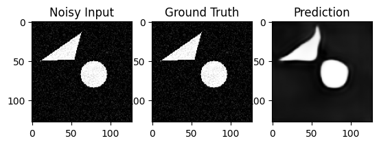
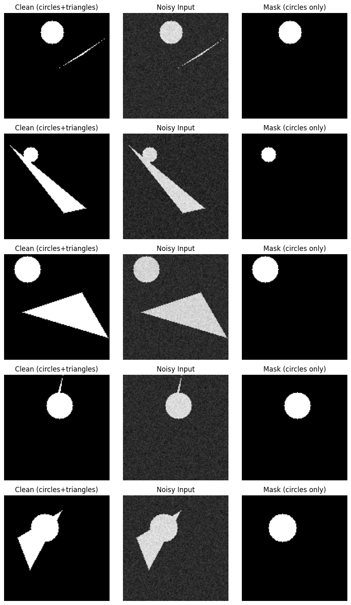
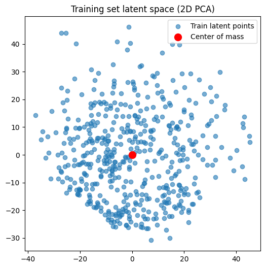
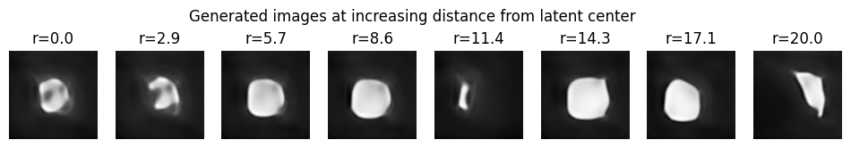

## 🧩 Noisy Particle Segmentation with Autoencoder

This project explores segmentation and reconstruction of **noisy synthetic particles** (circles with triangle distractors) using a **convolutional autoencoder (VAE-style latent representation)**.  
It includes tools for dataset generation, model training, latent space visualization, and sampling new shapes from the learned distribution.

---

## 🚀 Features
- **Synthetic dataset** of circles + triangle distractors.
- **Fourier-based noise injection** to simulate experimental noise.
- **Convolutional Autoencoder** with 1D latent embedding.
- **Weighted loss function** to emphasize segmentation of particle regions.
- **Latent space visualization** (PCA) + center-of-mass analysis.
- **Latent sampling** to generate new synthetic shapes.

---

## 📂 Repository Structure
```
  src/ # Source code
  ├── dataset.py # Dataset generation + noise
  ├── model.py # Autoencoder architecture
  ├── train.py # Training loop
  ├── visualize.py # Latent space + reconstruction plots
  └── utils.py # Losses + helpers
  
  notebooks/ # Jupyter notebooks
  └── demo.ipynb # End-to-end demo
  
  results/ # Example outputs
  ├── reconstructions/
  └── latent_space/
```
---

## 🛠 Installation
Clone the repo and install dependencies:
```bash
git clone https://github.com/cuauhtemocnv/noisy-particle-segmentation-vae.git
cd noisy-particle-segmentation-vae
pip install -r requirements.txt
```
## Dependencies:
```
torch

numpy

matplotlib

scikit-image

scikit-learn

```
## 📖 Usage
1. Train the autoencoder
```
python src/train.py
```
3. Visualize reconstructions
```
python src/visualize.py --mode reconstructions
```
4. Explore latent space
```
python src/visualize.py --mode latent
```

Or open the Jupyter demo:
```
jupyter notebook notebooks/demo.ipynb
```
## 📊 Example Results

Input vs Ground Truth vs Reconstruction

<p align="center">  </p>
<p align="center">  </p>

Latent Space (2D PCA projection)

<p align="center">  </p>

Inspired by research in denoising autoencoders and representation learning.
<p align="center">  </p>

Fourier-based noise model adapted from standard image augmentation techniques.
